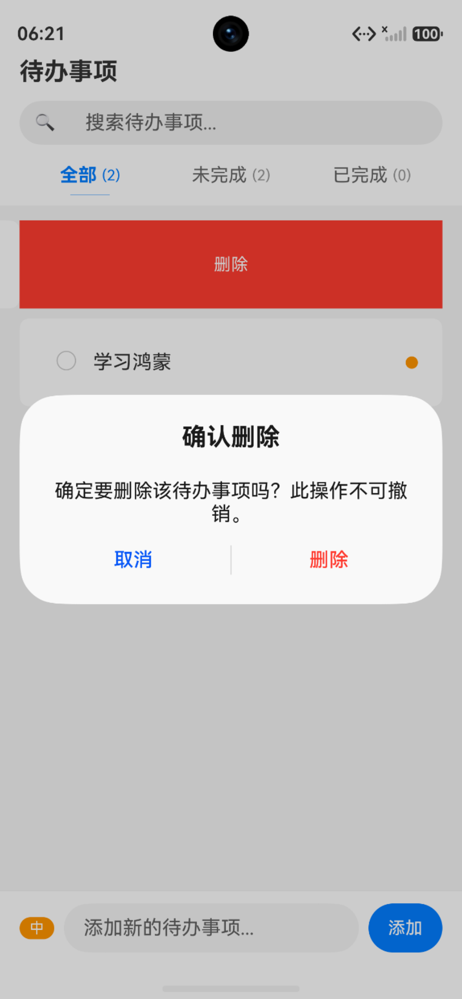
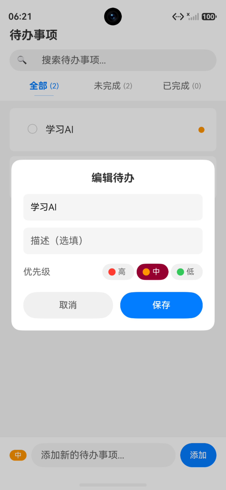

# HarmonyOS 待办事项 Todo App

基于 ArkTS + ArkUI 声明式开发、Stage 应用模型、原生关系型数据库实现的本地待办管理应用，完整实现待办增删改查、搜索筛选、优先级标记、批量操作、本地持久化等功能。

## 一、项目展示

|         首页         |         未完成         |         已完成         |
|:-------------------:|:-------------------:|:------------------:|
|  |  |  |

|         空列表         |         添加         |         删除         |
|:------------------:|:------------------:|:------------------:|
|  |  |  |

|        批量删除        |         编辑         |         搜索         |
|:------------------:|:------------------:|:------------------:|
|  |  |  |

## 二、技术栈
- **开发语言**：ArkTS
- **UI 框架**：ArkUI 声明式开发范式
- **应用模型**：Stage 模型
- **数据持久化**：`@ohos.data.relationalStore` 基于 SQLite 关系型数据库本地存储
- **状态管理**：`@State`、`@Prop`、`@Link`、`@Provide/@Consume` 响应式状态装饰器

## 三、数据模型设计
### TodoItem 模型字段说明
| 字段 | 类型 | 说明 |
|------|------|------|
| id | number | 主键，自增，数据库自动生成 |
| title | string | 待办标题（必填） |
| description | string | 待办描述（选填） |
| completed | boolean | 是否已完成，默认 false |
| priority | number | 优先级：1=高, 2=中, 3=低 |
| createdAt | number | 创建时间戳（毫秒） |
| updatedAt | number | 最后更新时间戳（毫秒） |

## 四、核心功能
### 4.1 新增待办
- 页面底部输入框 + 添加按钮
- 支持点击添加、键盘回车确认新增
- 新增后自动刷新列表、清空输入框
- 支持高/中/低优先级选择

### 4.2 删除待办
- 单个待办左滑删除（ListItem swipeAction）
- 删除前弹窗二次确认，防止误操作
- 支持长按进入多选模式，底部批量删除

### 4.3 编辑待办
- 点击待办项唤起编辑弹窗/编辑页面
- 可修改标题、描述、优先级
- 编辑后更新数据库并实时刷新列表

### 4.4 完成状态标记
- 列表项左侧 Checkbox 切换完成/未完成
- 已完成项自动添加删除线、灰色文字
- 状态变更实时入库持久化

### 4.5 搜索待办
- 顶部搜索框实时关键词过滤
- 支持标题模糊搜索
- 搜索结果内可正常进行标记、删除、编辑操作

### 4.6 分类筛选
- 顶部 Tab：全部 / 未完成 / 已完成
- 切换 Tab 自动过滤对应待办
- 筛选 + 搜索可组合生效
- Tab 显示对应分类数量统计
- 应用默认进入「全部」标签页

### 4.7 空状态提示
- 列表无数据时展示空状态插图与提示文案
- 不同 Tab 匹配不同空文案：暂无待办、所有任务已完成、还没完成任务等

## 五、项目文件结构
```text
src/main/ets/
├── model/
│   ├── TodoItem.ts       # 待办数据模型接口
│   └── TodoDatabase.ts   # 数据库管理器（CRUD 封装）
├── pages/
│   └── TodoPage.ets      # 主页面（核心 UI + 业务逻辑）
├── components/
│   ├── TodoInputBar.ets  # 底部输入添加组件
│   └── FilterTabBar.ets  # 筛选 Tab 栏组件
├── entryability/
│   └── EntryAbility.ets  # 应用入口
└── utils/
    └── Logger.ets        # 日志工具类
```
## 六、数据库封装能力（TodoDatabase.ts）
1. `initDatabase(context)`  
   初始化数据库、自动创建 todos 数据表
2. `insertTodo(item)`  
   新增待办，返回自增主键 id
3. `updateTodo(id, updates)`  
   根据 id 更新待办任意字段
4. `deleteTodo(id)`  
   删除单条待办
5. `deleteBatch(ids)`  
   批量删除多条待办
6. `queryTodos(filter, keyword)`  
   组合条件查询：
    - filter：`all` / `active` / `completed`
    - keyword：标题模糊搜索，空则查全部
    - 结果按 createdAt 时间戳降序排列
7. `toggleTodo(id)`  
   切换待办完成状态，同步更新 updatedAt 时间戳

## 七、UI 设计规范
- 遵循 HarmonyOS Design 设计风格，界面简洁干净
- 主题主色调：`#007DFF`，页面浅灰背景
- 已完成待办：文字灰色 `#999999` + 删除线样式
- 优先级颜色标识：高(红)、中(橙)、低(绿) 小圆点
- 列表采用 List + LazyForEach 高性能懒加载
- 搜索框支持一键清空
- 底部输入栏固定布局，列表区域自适应滚动
- 空状态使用系统图标+友好文字提示

## 八、状态管理规范
- 页面级数据（待办列表、搜索关键词、筛选类型）使用 `@State` 管理
- 父子组件通信采用 `@Provide/@Consume` 实现跨层级数据共享
- 增删改查数据变更后及时刷新状态变量，驱动 UI 自动更新
- 在页面 `aboutToAppear` 生命周期中完成数据库初始化与首次数据加载

## 九、项目约束与规范
- 所有代码统一放在 entry 单个 Module，不做多模块拆分
- 关键业务逻辑添加中文注释，代码可读性高
- 数据库操作完善异常捕获，失败弹出 Toast 提示
- 项目可直接导入 DevEco Studio 编译、模拟器/真机正常运行